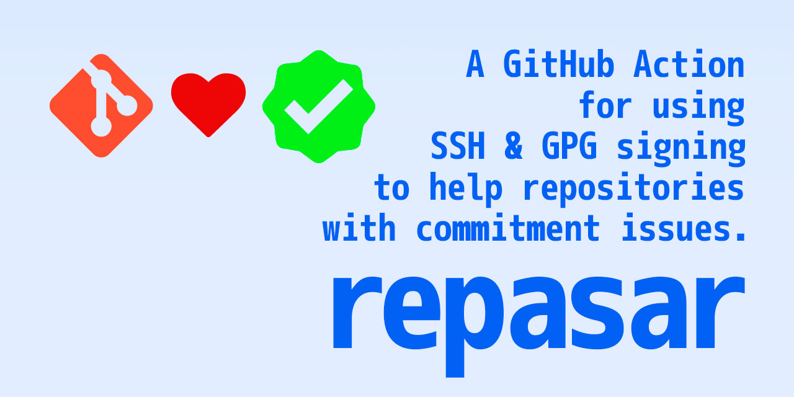

# Repasar

The Repasar GitHub Action (GHA) checks the commit signatures for security. It
now supports verifying **all commits in a pull request (PR)**, not just the
latest commit. For push events, it continues to verify the latest commit as
before.

- For PRs: All commits in the PR are checked for verified signatures.
- For pushes: Only the latest commit is checked.

## Setup

Copy the text below into a file in your repository called
`.github/workflows/verified_commits_check.yml` then just commit and push it to
your default branch.

```sh
# .github/workflows/verify-commits.yml
name: Verifying the latest commit
run-name: ${{ github.actor }} is verifying the validity of current commit
on: [push]
jobs:
  check-sha:
    runs-on: ubuntu-latest
    name: Check the SHA of the latest commit
    steps:
      - name: Checkout the code
        uses: actions/checkout@v3
      - name: Run repasar on the latest SHA
        uses: rogeruiz/repasar@v1.0.0
        with:
          allowed-signers-file-path: ./.github/allowed_signers
          fail-on-unverified: true
```

## Required inputs

The only required input is the `allowed-signers-file-path` which is recommended
to be resolved to `./.github/allowed_signers`. This file contains the public SSH
keys in the following format per-line.

```sh
<email>[,<email>...] <key type> <public key>
```

These public keys are safe to check into your repository. To generate this file
based on the public keys available on GitHub for committers to the repository,
you can generate them using the `allowedSignersFile` project by @frankywahl.
This file can also be maintained manually and checked in by each individual
committer for your projects.

[=> frankywahl/allowedSignersFile project](https://github.com/frankywahl/allowedSignersFile)

## Optional inputs

By default, this Action does not fail the run if the verification of the commit
is unsuccessful. If you would like to have the Action fail, then set the
`fail-on-unverified` to `true` in the `workflows/` Yaml file.

## Environment variables the action uses

- `${GITHUB_SHA}`: Used for single commit verification (push events).
- `${GITHUB_EVENT_NAME}` and `${GITHUB_EVENT_PATH}`: Used to detect PR context
  and extract PR number.
- `${GITHUB_TOKEN}`: **Required for PR verification** to fetch all commits in
  the PR using the GitHub API.

**Note:** For PRs, ensure the workflow has access to `GITHUB_TOKEN` (default in
GitHub Actions) and that the token has `repo` scope for private repositories.
